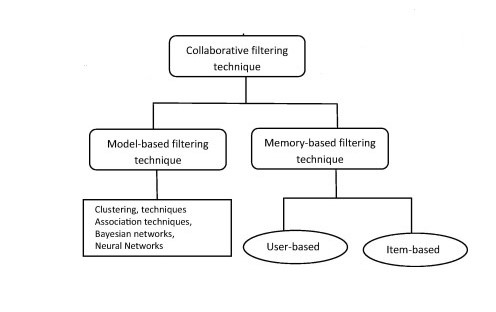
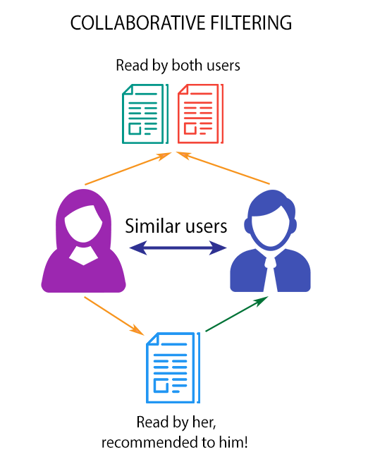

# Anime-Recommendation-System

## Recommendation Systems

We literally see Recommendation Systems all around us. Online shopping sites like Amazon where products are recommended to us, or media service providers like Netflix or Amazon Prime where movies or tv shows are recommended or social cataloguing websites like goodreads where books are recommended!

So how do these people do it!? How are Products, Movies or Books recommended to us in a personalised way?

First, let’s look into the low tech way of doing this!
How do we do it? Friends right! Friends or Cousins or whoever we think have better “taste” in shopping, books or movies than the others, something we’ve learnt over time by observing whether they usually like the same things as you. But is it practical that they would be knowing about everything out there? No.

There comes COLLABORATIVE FILTERING! Making it all pretty practical and easier – the more tech way of doing it!
A collaborative filtering algorithm usually works by searching a large group of people and finding a smaller set with tastes similar to yours. It looks at other things they like and combines them to create a ranked list of suggestions. There are a lot of ways of deciding which people are similar and combining their choices to make a list.

## TYPES OF COLLBORATIVE FILTERING

In this project we're using Memory-Based Filtering technique.
  1. User Based
  2. Item Based

User Based           |  Item Based
:-------------------------:|:-------------------------:
  |  

## Dataset Info

This data set contains information on user preference data from 73,516 users on 12,294 anime. Each user is able to add anime to their completed list and give it a rating and this data set is a compilation of those ratings.

Here's the link to the Kaggle Dataset ==> https://www.kaggle.com/CooperUnion/anime-recommendations-database

## Content

It has 2 files

1. Anime.csv
2. Rating.csv

As the file is too large, you wont find the file uploaded here. Instead here's the drive link to the files!

https://drive.google.com/open?id=1_hZA7JmXp67tqSUL95Eq_wsX9FInCEXK

